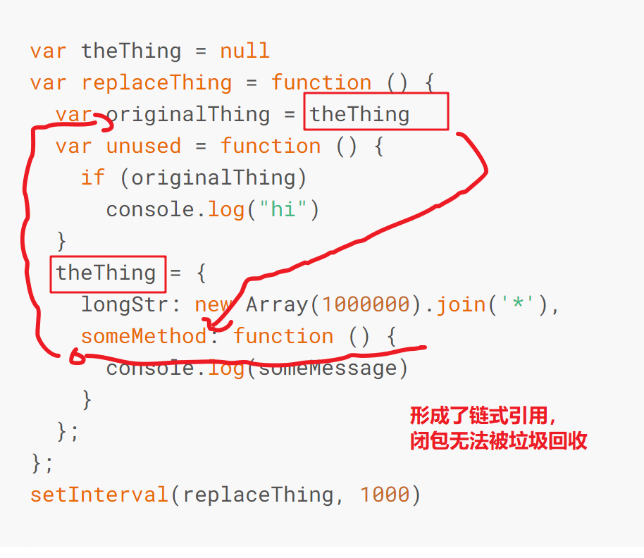

[V8 垃圾回收](https://mp.weixin.qq.com/s?src=11&timestamp=1618993126&ver=3021&signature=QHDE45oojQA2oVZSN29sUSzwVKIk99BiOkIEXryH0XBtUWSVgR-KrygzljMPcqs5dD32BxUbqcj42MkL1n5tADYZj6mvTLFkmzWdp9BcSEnn6OBjq7h2wBwV*ofVuqDp&new=1)

[NODE_JS 垃圾回收](https://www.nodejs.red/#/nodejs/memory)

- [闭包案例](https://www.nodejs.red/#/nodejs/memory?id=%e9%97%ad%e5%8c%85)

# v8 GC 机制

> 垃圾回收是指回收那些在应用程序中不再引用的对象，当一个对象无法从根节点访问这个对象就会做为垃圾回收的候选对象。这里的根对象可以为全局对象、局部变量，无法从根节点访问指的也就是不会在被任何其它活动对象所引用。

# 新生代与老生代

> 绝对大多数的应用程序对象的存活周期都会很短，而少数对象的存活周期将会很长为了利用这种情况，V8 将堆分为两类新生代和老生代，新空间中的对象都非常小大约为 1-8MB，这里的垃圾回收也很快。新生代空间中垃圾回收过程中幸存下来的对象会被提升到老生代空间。
